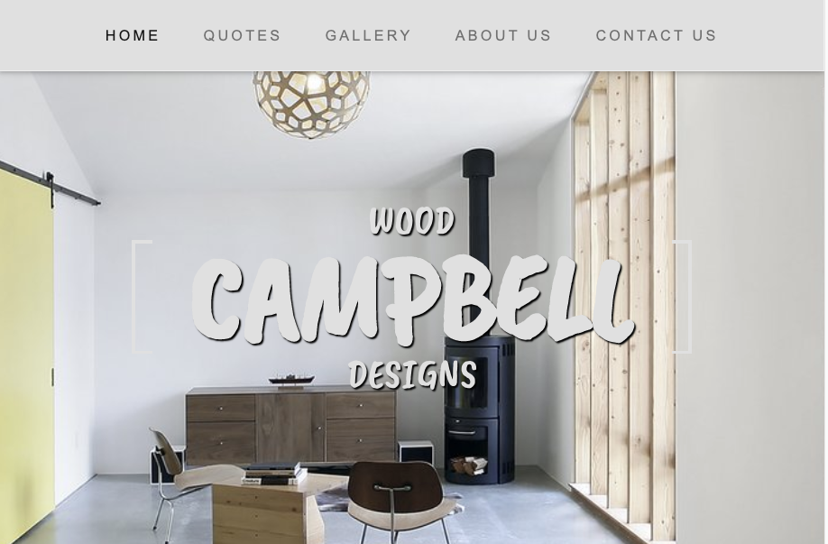
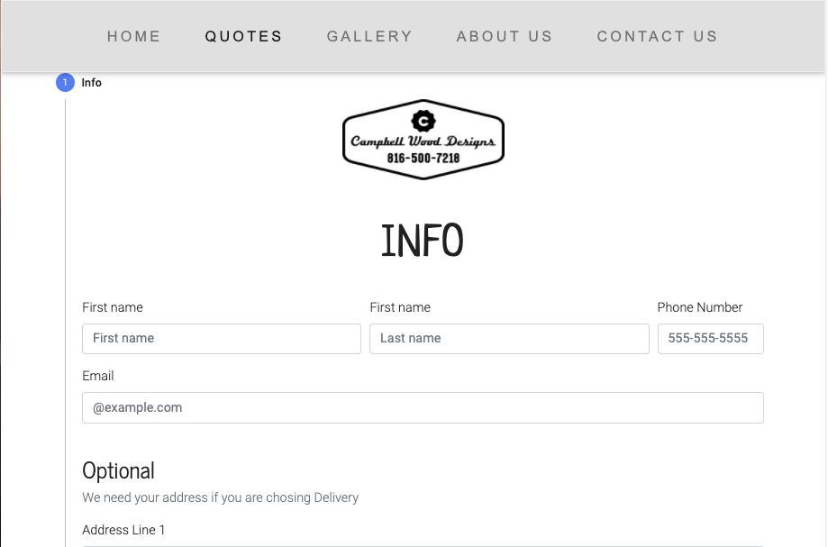
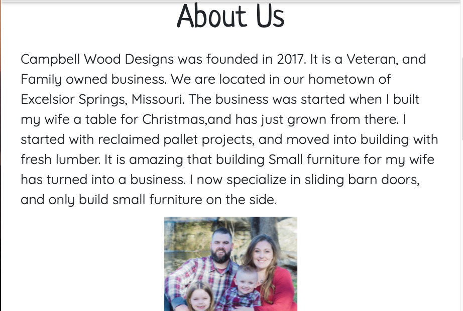

# Final_Project

Progressive Web Application in React.js

## App description

The application is desgined for the small buisness owner, "Cambell Wood Designs", to interact with the public. The public will be able to view the services offered, choose options and request a quote. The application will
email the quote request with the customer's contact information to the business. Then the buisness will contact the customer with a priced estimate.

## User Story

I as a business owner need to a interactive application of my services
for my customers pick what they want and request a qoute from me...
SO that I can give them an estimate quickly and accurately.

## Business Context

A business with it's services on an interactive web application enables a wider reach into it's market, adds professionalism, saves time, and provides an organized system to handle quotes and estimates for new customers and returning customers.

## Requirements

- Use ReactJS
- Use Node and Express Web Server
- Have a database with MongoDB, MySQL, Mongoose ORM, or Sequelize
- Have GET and POST routes
- Be deployed on Heroku with data
- Utilize two libraries, packages, or technologies
- Must have a polished frontend UI
- Must have a folder structure that meets Model View Controller Paradigm
- Need to good quality coding standards( indentation, scoping, naming )
- Must not expose senstive API Key information on the server

## Links

[App Outline](https://docs.google.com/document/d/1ESl2eX4hu2AN4E2GyrJiWak7YHUntaZ_2aY9DNLk6OA/edit?usp=sharing)

[App Flowchart Draw.io](https://drive.google.com/file/d/1wnlQfpoxs7T9LlvgihwG9tWTevwQZAJB/view?usp=sharing)

## Demo

[Link to deployed application]()

